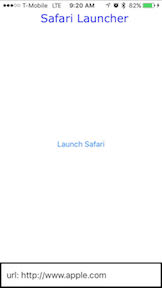

## Mobile Web on iOS 9.3 and below Real Devices: SafariLauncher

## 移动web运行在iOS 9.3及以下版本iOS的真实设备：SafariLauncher

Running mobile web tests on iOS real devices with iOS 9.3 or below, using Instruments,
requires the introduction of a third-party app, [SafariLauncher](https://github.com/snevesbarros/SafariLauncher).
This is necessary because with Instruments there is no way to start the Safari
app on the device. The `SafariLauncher` app just launches, and then launches
Safari. Simple!

在使用iOS 9.3或更低版本的iOS真实设备上运行移动web测试需要引入第三方应用程序[SafariLauncher](https://github.com/snevesbarros/SafariLauncher)。 这是必要的，因为工具没有办法在设备上启动Safari应用程序。只有先启动SafariLauncher应用程序，然后才能启动Safari。简单！


In some configurations, Appium is able to automatically build, sign, and install
`SafariLauncher` as it needs, and there is nothing else necessary to be done. If,
however, this is not the case, as is more often so with later versions of
[Xcode](https://developer.apple.com/xcode/), the following configuration needs to
be done before Safari tests on real devices can be successfully run.

在某些配置中，Appium能够根据需要自动构建，签名和安装SafariLauncher，没有什么必要做的。 但是，如果不是这种情况，则随着[Xcode](https://developer.apple.com/xcode/)的更新版本更为常见，在真实设备的Safari测试可以成功运行之前，需要完成以下配置。


### Automatic SafariLauncher configuration

### 自动配置SafariLauncher

The only thing needed for automatic `SafariLauncher` configuration is to create
a **provisioning profile** that can be used to deploy the `SafariLauncher` App.
This requires, in particular, a wildcard certificate, which is not possible if
your Apple developer account is a free one. If that is the case, skip to the
manual configuration below.

自动SafariLauncher配置唯一需要的是创建一个可用于部署SafariLauncher App的**配置文件**。 这尤其需要通配符证书，如果您的Apple开发者帐户是免费的，这是不可能的。 如果是这种情况，请跳转到下面的手动配置内容。

To create a profile for the launcher go into the **Apple Developers Member Center** and:

  * **Step 1:** Create a **new App Id** and select the WildCard App ID option and set it to "*"
  * **Step 2:** Create a **new Development Profile** and for App Id select the one created in step 1.
  * **Step 3:** Select your **certificate(s) and device(s)** and click next.
  * **Step 4:** Set the profile name and **generate the profile**.
  * **Step 5:** Download the profile and open it with a text editor.
  * **Step 6:** Search for the **UUID** and the string for it is your **identity code**.

要创建启动器的配置文件，请进入**Apple Developers会员中心**，按如下步骤操作：

步骤1：创建一个新的**APP ID**，并选择WildCard APP ID选项，将其设置为“ * ”
步骤2：创建一个**新的开发配置文件**，App Id选择在步骤1中创建的。
步骤3：选择您的**证书和设备**，然后单击下一步。
步骤4：设置配置文件名称并**生成配置文件**。
步骤5：下载配置文件并用文本编辑器打开。
步骤6：搜索**UUID**及其字符串作为您的**身份代码**。

Now simply include your UDID and device name in your desired capabilities:

现在只需将您的UDID和设备名称包含在您所需的功能中：

```js
{
  udid: '...',
  deviceName: '...',
  platformName: 'iOS',
  platformVersion: '9.3',
  browserName: 'Safari'
}
```


### Manual SafariLauncher configuration
### 手动配置SafariLauncher

**Note:** This procedure assumes you have [Xcode](https://developer.apple.com/xcode/) 7.3 or 7.3.1.

**注意：** 此过程假定您已经安装[Xcode](https://developer.apple.com/xcode/)7.3或7.3.1。

It is possible to use the version of [SafariLauncher](https://github.com/snevesbarros/SafariLauncher)
that comes with the [appium-ios-driver](https://github.com/appium/appium-ios-driver),
but if you do, each time you update Appium the procedure will have to be done again.

可以使用appium-ios-driver附带的SafariLauncher版本，但如果这样做，每次更新Appium时，必须重新执行该过程。

To get a local copy of `SafariLauncher`, first clone it from [GitHub](https://github.com/):
要获取SafariLauncher的本地副本，请先从GitHub克隆它：

```bash
git clone https://github.com/snevesbarros/SafariLauncher.git
```

Once you have a local copy of the source code for the `SafariLauncher` app, open
[Xcode](https://developer.apple.com/xcode/) and then open the `SafariLauncher` project

一旦您拥有SafariLauncher app的源代码的本地副本，请打开Xcode，然后打开SafariLauncher项目


In the `SafariLauncher` target pane you will see an error, saying that there needs
to be a provisioning profile for this app

在SafariLauncher目标窗口中，您会看到一个错误，表示需要有一个此app的配置文件


In order to fix this, you first need to enter a "Bundle Identifier" for the app. The default
expected by Appium is `com.bytearc.SafariLauncher`, but this might not be available
for you to build. In that case, choose something else, and make note of it. Then
choose a "Team", and allow the provisioning profile to be created

为了解决这个问题，您首先需要为app输入“Bundle Identifier”。 Appium期望的默认值为com.bytearc.SafariLauncher，但这可能无法用于构建。 在这种情况下，请选择其他的东西，并记下它。 然后选择“Team”，并允许创建配置文件


Finally, make sure your device is connected to the computer, and choose it as the
target

最后，确保您的设备已连接到计算机，并将其选为目标设备


And run the build and install actions to compile the app and push it onto your
device

并运行构建和安装操作来编译app并将其推送到您的设备上


Now you have a working `SafariLauncher` on your device. The app itself is a plain
screen that will launch `Safari` at the click of a button

现在你的设备上有一个可用的SafariLauncher。 该app本身是一个简单的屏幕，点击一个按钮将启动Safari



The last step is only necessary if you chose a bundle identifier for the app that
is different from the default (`com.bytearc.SafariLauncher`). If you did, it is
necessary to send that to Appium when creating a session, using the `bundleId`
desired capability:

如果您选择了与默认（com.bytearc.SafariLauncher）不同的app的软件包标识符，则最后一步是必需的。 如果你这样做，在使用bundleId所需的功能创建会话时，需要将它发送到Appium：

```js
{
  udid: '...',
  deviceName: '...',
  platformName: 'iOS',
  platformVersion: '9.3',
  browserName: 'Safari',
  bundleId: 'com.imurchie.SafariLauncher'
}
```
